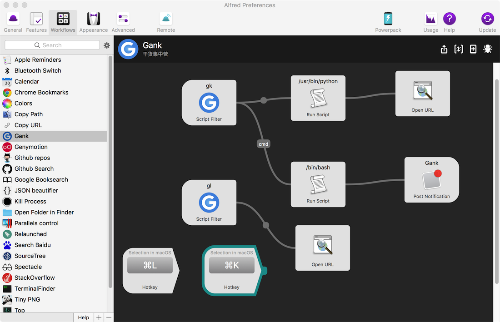
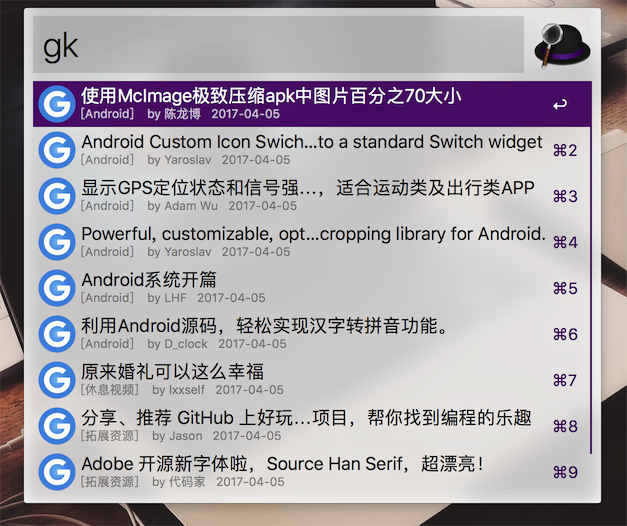
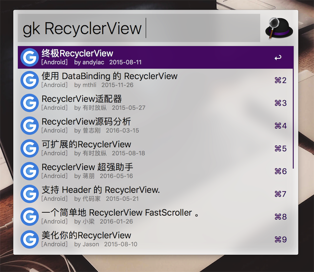
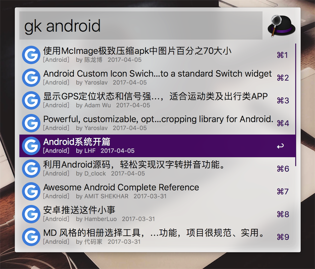

### 干货集中营 workflow

> 使用`python`编写的`Alfred workflow`，接入的是干货集中营对应的API接口。以后可以直接用小红帽查看干货喽~，而且还能一键收藏到`MarkDown`哦 :)

提供了以下功能：

1. 查询干货数据（每日数据，分类数据，条件查询等）
2. **收藏数据到`markdown`中**（按干货提供的分类进行收藏）
3. **浏览收藏的`md`文件**

#### 效果图

##### 每日干货数据

##### 关键字匹配搜索

##### 指定类型的数据

操作演示图：

具体操作快捷键自己按习惯设置即可。

查询中，为了防止频繁访问接口，做了以下优化：

* 查询以最后输入的空格键为触发
* 输入字符过少，不进行查询动作(限制在3个字符)
* 查询数据使用缓存处理，默认缓存时间1小时

由于干货API中某些类型是中文，在实现中针对中文进行了转换：

| 命令           | 描述                 |
| ------------ | ------------------ |
| `gk android` | `android`对应的前15条数据 |
| `gk ios `    | `iOS`对应的前15条数据     |
| `gk app`     | `app`对应的前15条数据     |
| `gk fuli`    | `福利`对应的前15条数据      |
| `gk video`   | `休闲视频`对应的前15条数据    |
| `gk res`     | `拓展资源`对应的前15条数据    |
| `gk front`   | `前端`对应的前15条数据      |
| `gk other`   | `瞎推荐`对应的前15条数据     |

查询【收藏数据】与之对应，使用`gl`命令

